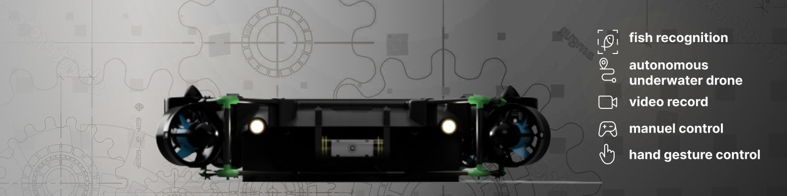
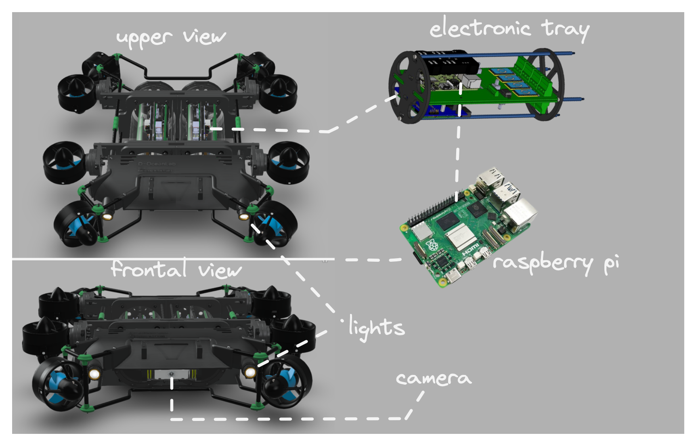

# D~OceanLab

authors:
Talisma Manuel 
model v0.1

### Overview

This project about an underwater drone equipped with intelligent computer vision capabilities. The drone is able to track objects autonomously, making it a valuable tool for various underwater applications.

 

    
  

    
## Current features Stage

Object Tracking in Google Colab: We've trained a model for object tracking, focusing on fish for now. This code resides within the repository.

  

    
Hand Gesture Recognition (Colab): Another Colab notebook explores hand gesture recognition, potentially for future drone control.

